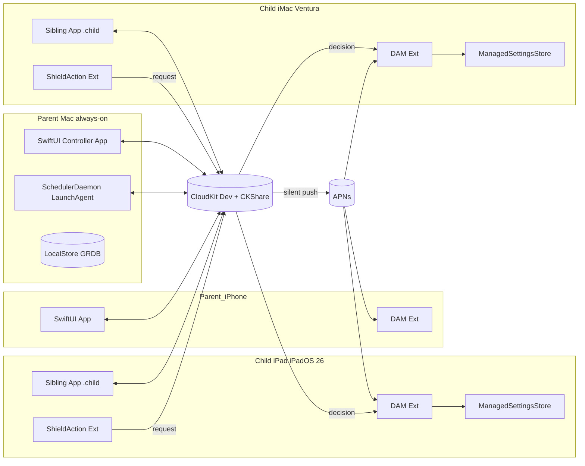

# PLAN_A — Native Swift + CloudKit Screen Time Scheduler

## Context
Apple's FamilyControls / ManagedSettings / DeviceActivity (RESEARCH §1) let a third-party app shield apps on a schedule on iOS 16+, iPadOS 16+, and macOS 13+. Per RESEARCH §9 this household runs on the **paid-developer-program development entitlement** path: no distribution review, no App Review, schema mutable in Development CloudKit forever, $99/yr plus one annual reinstall per device. That eliminates the entitlement-delay and AFMT-imitation-rejection risks prior drafts carried.

Target child devices: **one iPad on iPadOS 26** (full modern API surface) and **one iMac 2017 on macOS 13 Ventura** (Screen Time APIs present, with known parity gaps — see Enforcement). The child uses their own macOS user account on the iMac. Parent controls run on the same multiplatform app on the parent's Mac and iPhone. The "always-on" Mac is either a separate parent Mac, **or the same iMac running two user accounts simultaneously** via fast user switching (see Multi-user topology). The Mac is the canonical writer; iPhone is intermittent.

The prior draft proposed a hybrid of Apple's system Downtime (for the dominant window) and third-party shields (for the rest), to preserve Apple's native "more time" UI on at least one window. The hybrid is **dropped**. It was a convention, not an integration: the app could not read back system Downtime, so drift was silent, and two enforcement regimes ran side-by-side with no arbitration (CRITIQUE_1/2/3 all hit this). With the user's relaxed AFMT requirement below, the hybrid's only justification disappears. The revised plan runs **one enforcement regime** — third-party ManagedSettings shields on every window — with an in-app request/approve flow.

## Ask-For-More-Time (simplified per the new requirement)
The child does **not** see a pixel-perfect reimplementation of Apple's sheet. The flow:

1. Child taps a shielded app → the `ShieldActionExtension` exposes an "Ask for time" action.
2. Tap writes `CDExtensionRequest` to a local outbox (extension may be killed mid-write), then to CloudKit.
3. `CKQuerySubscription` silent push wakes parent devices.
4. Parent sees a standard `UNNotification` with four `UNNotificationAction`s: **Reject / +15m / +1h / Rest-of-day** (where rest-of-day = next local midnight in the **child's** timezone).
5. Parent taps an action → device writes a `CDOverride(kind, expiresAt)` to CloudKit.
6. Child's DAM extension wakes via push, clears the `ManagedSettingsStore` shield for the granted duration via a one-shot tail `DeviceActivitySchedule`, or holds it on reject.

Round-trip target: <10s with both ends online. The Mac daemon is the always-online fallback when the parent iPhone is asleep — it surfaces the same action notification in the logged-in macOS session.

## Architecture diagram



## Multi-user topology (macOS)
On macOS, FamilyControls / ManagedSettings / DeviceActivity are scoped to a user account: each macOS user has their own iCloud, their own ManagedSettings store, their own DAM extension instance. The child's enforcement therefore lives entirely inside the child's user session on the iMac, authorized to the child's iCloud (which is in the family-sharing group). The parent's Controller app and `SchedulerDaemon` LaunchAgent live in the parent admin user session — either on a separate Mac, or on the same iMac as a second concurrent user.

The two scenarios behave differently in two places:

- **Separate Mac for parent (simple case)**: as drawn. Parent admin is logged in 24/7 on its own hardware; child uses the iMac alone; CloudKit + CKShare bridges them.
- **Shared iMac (parent admin + child as two accounts)**: works, with three concrete bootstrap and runtime requirements.
  1. **Parent must be loaded since boot.** A LaunchAgent only runs while its user has a loaded session — even a *background* session (post-fast-user-switch) is fine, but a never-logged-in user has no LaunchAgents at all. Bootstrap: enable **automatic login for the parent admin** in System Settings → Users & Groups, plus a one-shot login-time helper that immediately fast-user-switches to the child (`CGSession -switchToUserID <childUID>`). After a reboot the parent's session is loaded and backgrounded, the child becomes the foreground user, and the parent's daemon is alive. The parent must **switch to**, never **log out of**, their account.
  2. **Notifications cannot display from a background user session.** `UNNotification` banners only render for the active console user, so any approval prompt the parent's Mac daemon raises while the child is foreground is invisible. In the shared-iMac scenario the parent's iPhone is the **primary approval surface**; the Mac daemon only writes/relays via CloudKit + APNs. The Mac surfaces the request when the parent is next foreground, as a backlog view.
  3. **Wake-nudge applies to both sessions.** The wake-from-sleep DAM nudge described under Enforcement runs once per loaded user session — one helper in the child's session for the child's DAM, one in the parent's session for the daemon. Both are LaunchAgents tied to `com.apple.system.power.useractivity` events.

CloudKit between the two iCloud accounts on the same Mac is identical to the cross-machine case: parent's private DB hosts the records, child's iCloud reads/writes via the CKShare. There is no IPC shortcut for the same-host case; the design treats them as independent peers and relies on CloudKit for propagation.

## Data model
- **Schedule**: per-child weekly template. `Window`s, `version`, `updatedAt`.
- **Window**: `id`, `weekdays`, `start`, `end`, `groupId: WindowGroupID`, `allowRequests`. No enforcement enum — every window is a shield.
- **Override**: append-only. `id`, `childId`, `deviceId?`, `kind`, `createdBy`, `createdAt`, `expiresAt`. `kind ∈ { reject, extend(minutes), restOfDay, skipWindow(id), addBlock(start,end), disableAllForDay }`.
- **Child**: `id`, `displayName`, `timezone`, `devices: [Device]`.
- **Device**: `id`, `platform ∈ { iPadOS, macOS, iOS }`, `osVersion`, `capabilities: Set<Capability>`.
- **TokenBundle**: per-device opaque token blobs keyed by `deviceId`, indexed by stable `WindowGroupID`. Tokens stay on the device that picked them; other devices see only the group reference.
- **CDExtensionRequest**: `id`, `deviceId`, `windowId`, `appTokenRef`, `createdAt`, `state ∈ { pending, decided }`, `decisionRef?`.

**Conflict resolution**: Overrides are append-only (delete + insert, never edit). Schedule/Window use `updatedAt` LWW with the **Mac daemon as canonical writer** — other devices' edits are proposals the daemon reconciles within seconds before broadcasting, sidestepping the clock-skew failure CRITIQUE_3 raised.

## Sync strategy (CloudKit)
- Parent iCloud private DB, custom zone `ScheduleZone`, `CKShare` to each child Apple ID.
- Runs against **Development CloudKit** (RESEARCH §9). Schema is mutable forever; no "Deploy to Production" step ever.
- Records: `CDSchedule`, `CDWindow`, `CDOverride`, `CDChild`, `CDDevice`, `CDExtensionRequest`, `CDTokenBundleRef` (no actual tokens). Per-type `CKQuerySubscription` for silent pushes.
- Each device runs an `actor SyncCoordinator` that materializes CK records into a local GRDB cache in the App Group container and feeds the enforcement layer.
- Onboarding order: **QR-bootstrap handshake first** (exchanges CK zone identifiers + record-encryption keys over local transport), CKShare second. Known under-13 CKShare flakiness thus never blocks first-run.

## Enforcement per device
The prior draft registered seven schedules per window per device plus per-window anchors, multiplying the race surface and pushing against the undocumented DAM ceiling for any non-trivial plan. Revised: **one schedule per window**, with weekday and override resolution deferred into `intervalDidStart` via `OverrideEngine.effectiveWindows(for: now, device:)`.

- **iPadOS 26 (child iPad)**: `DeviceActivityCenter` registers one schedule per window. `intervalDidStart` checks `weekday ∈ window.weekdays` against the local cache, applies the `ManagedSettingsStore` shield, and schedules a one-shot tail for any active extend/restOfDay override. `intervalDidEnd` clears the store. A **single** 00:01 daily anchor re-registers monitors, recovering from missed callbacks. The editor enforces non-overlapping windows (≥1s gap) so adjacent `intervalDidEnd`/`intervalDidStart` pairs cannot race a shared store (CRITIQUE_3 §5).
- **macOS 13 Ventura (child iMac 2017)**: same multiplatform target, same extension code. **Known parity gaps**: some `ManagedSettings` keys are no-ops on macOS 13; the `Capability` matrix on each `Device` record disables unsupported shield types in the editor for that device. `ShieldAction` on macOS is functional on 13+ but flakier — degraded fallback: the sibling app polls CloudKit every 60s while a shield is active so requests aren't lost to extension misfires. A lightweight LaunchAgent pings the DAM extension on wake from sleep, since macOS historically drops DAM callbacks across sleep cycles. The iMac is stuck on Ventura (hardware can't run 14+); whatever Apple has fixed since is unavailable here, so treat parity gaps as permanent.
- **Parent Mac (always-on)**: hosts the `SchedulerDaemon` as a **LaunchAgent** in the parent admin user session (NOT LaunchDaemon — FamilyControls auth requires a user-app context, and a LaunchDaemon at the loginwindow has no Mach bootstrap, no UNNotification access, and no FC). The daemon never holds FC auth itself; FC-gated operations are XPC-bounced to the Controller app. Responsibilities: canonical schedule writer, midnight override pruning, always-online fallback receiver for `CDExtensionRequest`, and — only when the parent is the foreground console user — presenter of action-bearing `UNNotification`s. When the parent is a *background* session (shared-iMac case), the daemon writes/relays only and lets the parent's iPhone be the user-facing approval surface.
- **Parent iPhone**: same multiplatform app, receives and can act on extension requests. Either parent device may decide; the Mac daemon arbitrates persistence order. **Canonical-writer fallback**: the daemon publishes a heartbeat record every 60s; if the iPhone observes >5min without a heartbeat (e.g. the iMac is rebooted and the parent's auto-login hasn't completed yet), it temporarily assumes canonical-writer role and the daemon picks back up cleanly when the next heartbeat is observed.

## Module layout
```
ScreenTimeScheduler/
  App/
    iOSApp.swift, iPadApp.swift, macOSApp.swift, AppDelegate+Push.swift
  Core/
    Models/         Schedule, Window, Override, Child, Device, TokenBundle
    Persistence/    LocalStore (GRDB), AppGroupPaths
    Sync/           CloudKitSchema, SyncCoordinator, SubscriptionManager, CanonicalWriter
    Scheduling/     ScheduleCompiler, OverrideEngine, CapabilityMatrix
    Enforcement/    ShieldController, TokenResolver
    Requests/       ExtensionRequestOutbox, NotificationActionHandler
  Extensions/
    DeviceActivityMonitorExtension/
    ShieldConfigurationExtension/
    ShieldActionExtension/
  UI/
    Onboarding/   FamilyControlsAuth, QRPairingView, DeviceCapabilityCheck
    Schedules/    ScheduleEditorView, WindowEditorView, FamilyActivityPickerHost
    Overrides/    TodayOverrideView
    Family/       ChildListView, DeviceListView
  macOSDaemon/
    SchedulerDaemon.swift (LaunchAgent), FCHelperXPC (→ Controller app)
  Shared/
    Logging.swift
```

### Key types
- `struct Window { let id: UUID; var weekdays: Weekdays; var start: TimeOfDay; var end: TimeOfDay; var groupId: WindowGroupID; var allowRequests: Bool }`
- `enum OverrideKind { case reject; case extend(Int); case restOfDay; case skipWindow(UUID); case addBlock(TimeOfDay, TimeOfDay); case disableAllForDay }`
- `struct Device { let id: UUID; let platform: Platform; let osVersion: String; var capabilities: Set<Capability> }`
- `actor SyncCoordinator { func start(); func upsert<T: CKSyncable>(_ value: T); func handleRemoteNotification(_: [AnyHashable: Any]) }`
- `struct OverrideEngine { func effectiveWindows(for date: Date, device: Device) -> [ResolvedWindow] }`
- `final class ShieldController { func apply(_ resolved: ResolvedWindow); func clear(_ id: UUID) }`

## Failure modes
1. **CK propagation lag** → child stays shielded after approve. Silent push + 60s foreground polling fallback while a request is pending; daemon nudges via high-priority `CKModifyRecordsOperation`.
2. **DAM missed callback** → shield never applies. Single 00:01 daily anchor re-registers monitors; macOS LaunchAgent pings DAM on wake.
3. **Token drift after iOS upgrade** → tokens invalidate. `TokenResolver` verifies tokens against installed inventory at launch and surfaces re-pick UI per group. Pain on the dev-entitlement path is low: Xcode is on-hand.
4. **Parent Mac AND iPhone offline** → no canonical writer; children enforce from local cache. New edits queue on the issuing device and flush on reconnect.
5. **Child uninstalls app** → blocked by FamilyControls `.child` (guardian passcode required).
6. **iCloud account change** on a device → CK zone resets; re-pair via QR.
7. **macOS API gaps** → `CapabilityMatrix` disables shield types the device can't enforce; editor greys them out per-device.
8. **User's own system Downtime overlapping ours** → orthogonal stores that don't arbitrate. Onboarding asks the user to disable system Downtime on enforced devices. No hidden mirror handshake.
9. **Adjacent-window boundary race** → editor enforces ≥1s gaps so two schedules never transition on the same store simultaneously.
10. **ShieldActionExtension killed mid-write** → extension writes to a local outbox first; main app flushes on next launch or DAM wake.
11. **Parent admin session not loaded since boot** (shared-iMac case) → no LaunchAgent, no canonical writer, no Mac-side relay. Mitigation: parent auto-login + login-time fast-user-switch helper (see Multi-user topology); iPhone heartbeat fallback temporarily assumes canonical-writer role until daemon resumes.
12. **Parent fast-user-switch session terminated** (real logout, memory pressure) → same as #11. Mitigation: same. Treat parent "Log Out" as a forbidden gesture; document in onboarding.

## Required Apple entitlements (development path)
- `com.apple.developer.family-controls` — **development** variant, auto-enabled in Xcode for paid-program members with no application (RESEARCH §9). App + all 3 extensions on both platforms.
- `com.apple.developer.deviceactivity`
- `com.apple.developer.icloud-services` = CloudKit (Development environment)
- `aps-environment` = development
- App Group `group.com.example.sts`
- Background modes: remote-notification, processing
- Hardened runtime + LaunchAgent plist for the Mac daemon

No distribution profile, no TestFlight, no App Store review. Annual per-device reinstall via Xcode (~10 min/device).

## Open risks
1. **CKShare-to-child** flakiness. Mitigated by QR-first onboarding.
2. **macOS 13 Ventura API parity**. iMac 2017 can't run 14+, so anything Apple has fixed since Ventura is unavailable on that device. `CapabilityMatrix` + polling fallback is the extent of the mitigation.
3. **macOS DAM reliability across sleep**. Wake-nudge LaunchAgent is a patch, not a fix.
4. **Token portability UX**: `FamilyActivityPicker` per device per group, repeated after iOS upgrades invalidate tokens.
5. **Developer program lapse**: $99/yr renewal. If it lapses, provisioning profiles revoke on next device check-in.
6. **iMac 2017 security EOL**: when Apple drops Ventura security updates, the Mac child target becomes security-obsolete. Household problem, not a plan defect, but worth flagging.
7. **Shared-iMac bootstrap fragility**: depends on parent auto-login + fast-user-switch helper firing on every boot. A failed login script leaves no parent daemon and only the iPhone fallback. Memory/CPU contention from running two concurrent user sessions on a 2017 iMac is a comfort issue, not a correctness one, but worth measuring.
