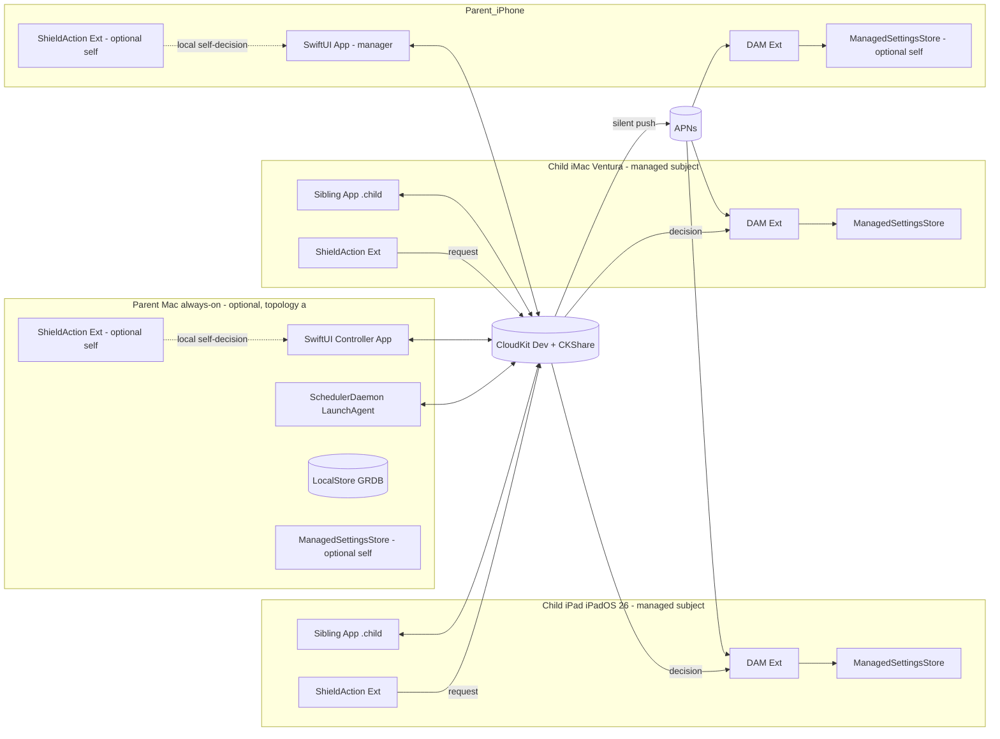

# PLAN_A — Native Swift + CloudKit Screen Time Scheduler

## Context
Apple's FamilyControls / ManagedSettings / DeviceActivity (RESEARCH §1) let a third-party app shield apps on a schedule on iOS 16+, iPadOS 16+, and macOS 13+. Per RESEARCH §9 this household runs on the **paid-developer-program development entitlement** path: no distribution review, no App Review, schema mutable in Development CloudKit forever, $99/yr plus one annual reinstall per device. That eliminates the entitlement-delay and AFMT-imitation-rejection risks prior drafts carried.

Primary enforcement targets: **one iPad on iPadOS 26** (full modern API surface) and **one iMac 2017 on macOS 13 Ventura** (Screen Time APIs present, with known parity gaps — see Enforcement). The iMac runs **only the child's user account**; the parent never logs in there and never uses it as a management surface. Parent controls run on the parent's iPhone, plus optionally a separate parent Mac (e.g. a MacBook) that hosts the optional `SchedulerDaemon` LaunchAgent for convenience features (midnight pruning, centralized validation, Mac-side notifications). If no separate parent Mac is present, the parent's iPhone is the only parent device — see Topology.

The management surface and the enforcement target are **orthogonal roles** — a single device can hold either, both, or neither. Any adult device can optionally self-shield while also managing other subjects; see *Subjects and roles* for the full role matrix.

The prior draft proposed a hybrid of Apple's system Downtime (for the dominant window) and third-party shields (for the rest), to preserve Apple's native "more time" UI on at least one window. The hybrid is **dropped**. It was a convention, not an integration: the app could not read back system Downtime, so drift was silent, and two enforcement regimes ran side-by-side with no arbitration (CRITIQUE_1/2/3 all hit this). With the user's relaxed AFMT requirement below, the hybrid's only justification disappears. The revised plan runs **one enforcement regime** — third-party ManagedSettings shields on every window — with an in-app request/approve flow.

## Subjects and roles
Prior drafts baked a "parent vs child" binary into the schema. That was wrong: management surface and enforcement target are **orthogonal** device roles, and shielding is valuable for adults too. A single device can hold either role, both, or neither.

- **Manager**: reads/writes the shared schedule zone via CloudKit and surfaces the SwiftUI editor. Needs no FamilyControls entitlement at runtime — it's just app code talking to CloudKit.
- **Target**: holds `FamilyControls` authorization and writes shields to its local `ManagedSettingsStore` based on its DAM extension's schedule. Authorization is per-device, per-app-instance, and exactly one of:
  - `.individual` — the device's user authorizes the app to manage their own device via a single in-app prompt. No Family Sharing relationship required, no parent-on-another-device approval. This is what an adult uses to self-shield.
  - `.child` — the device's iCloud must be a child in a Family Sharing group; approval comes from a guardian on another device via Screen Time passcode; the app cannot be uninstalled without that passcode.

A single app instance holds one FC authorization at a time, so a device targets either as `.individual` or as `.child`, not both. But that authorization is about *self*-shielding; it has nothing to do with whether the device can also manage other subjects via CloudKit.

The unit of shielding is therefore a **Subject**, not a device. A Subject is "an entity whose apps are shielded by some schedule," with `kind ∈ { self, managed }`:

- `Subject(kind: .self)` — an adult self-managing. Their devices hold `.individual` FC auth; the request/approve flow short-circuits locally (see AFMT below).
- `Subject(kind: .managed)` — what prior drafts called a Child. Devices hold `.child` FC auth; request/approve goes via CloudKit to the parent devices subscribed to that subject's `CDExtensionRequest`s.

The manager UI is identical regardless of kind: the editor shows a list of Subjects, each with a Schedule and a device list. One of those Subjects may be the user themselves. Concrete role assignments for this household:

| Device | Manager? | Target role | Subject kind |
| --- | --- | --- | --- |
| Parent iPhone | yes | optional `.individual` | optional `.self` |
| Parent Mac (topology (a)) | yes | optional `.individual` (admin user session) | optional `.self` |
| Child iPad | no | `.child` | `.managed` |
| Child iMac (child user session) | no | `.child` | `.managed` |

**Soft-lock semantics.** `.individual` auth can be revoked from Settings → Screen Time → "Apps with Screen Time Access" by the same person who granted it; there is no Screen Time passcode protecting it (that's a `.child`-mode feature). So an adult can always unilaterally bypass their own shield. That's the correct semantics for self-management — it's a focus tool, not a parental control on yourself — but the plan flags it explicitly so nobody expects otherwise.

## Ask-For-More-Time (simplified per the new requirement)
The child does **not** see a pixel-perfect reimplementation of Apple's sheet. The flow:

1. Child taps a shielded app → the `ShieldActionExtension` exposes an "Ask for time" action.
2. Tap writes `CDExtensionRequest` to a local outbox (extension may be killed mid-write), then to CloudKit.
3. `CKQuerySubscription` silent push wakes parent devices.
4. Parent sees a standard `UNNotification` with four `UNNotificationAction`s: **Reject / +15m / +1h / Rest-of-day** (where rest-of-day = next local midnight in the **child's** timezone).
5. Parent taps an action → device writes a `CDOverride(kind, expiresAt)` to CloudKit.
6. Child's DAM extension wakes via push, clears the `ManagedSettingsStore` shield for the granted duration via a one-shot tail `DeviceActivitySchedule`, or holds it on reject.

Round-trip target: <10s with both ends online. In topology (a) — separate parent Mac present — the Mac daemon is an always-online relay when the parent iPhone is asleep, and surfaces the same action notification in the parent's macOS session. In topology (b) the iPhone is the only approval surface, so latency is bounded by iPhone wake-from-push.

**Self-subject short-circuit.** For `Subject(kind: .self)` the round-trip collapses. The `ShieldActionExtension` on the adult's own device opens a local sheet in the sibling app instead of posting a remote request; the user taps **Reject / +15m / +1h / Rest-of-day** on themselves, and the app writes a `CDOverride` directly to the local GRDB cache (mirrored to CloudKit if the self-subject has additional devices to propagate to). No silent push, no remote approver — the user is approving themselves. Same UI components as the parent-approval sheet; the friction of "open the app, tap an option" is the point (interrupt the impulse, force a deliberate action). Steps 3–5 are skipped entirely; steps 1, 2, and 6 still run, with step 2's CloudKit mirror being best-effort.

## Architecture diagram



## Topology
FamilyControls / ManagedSettings / DeviceActivity on macOS are scoped per user account (each macOS user has their own iCloud, their own ManagedSettings store, their own DAM extension instance). The iMac therefore hosts **only the child's user session**, authorized to the child's iCloud in the family-sharing group, enforcing on that account. The parent does not have a session on the iMac — there is no auto-login dance, no fast-user-switch helper, no concurrent two-session memory pressure on a 2017 box, and no "parent must never log out" gesture restriction.

Two supported parent-side topologies:

- **(a) Separate parent Mac present** (e.g. a MacBook): hosts the optional `SchedulerDaemon` LaunchAgent for midnight override pruning (deterministic timer), centralized business-rule validation (convenience over per-client validation), and Mac-side action-notification surface. None of these are correctness-critical — every parent device writes directly to CloudKit and CloudKit's server-stamped timestamps + CAS handle conflict resolution. This is the configuration the Architecture diagram draws.
- **(b) No parent Mac**: the parent's iPhone is the only parent device, and it is just a regular CloudKit client. Override pruning falls back to lazy per-device cleanup on next `OverrideEngine` consultation.

Both topologies use CloudKit + CKShare for transport between the parent's iCloud and the child's iCloud. The choice between (a) and (b) is a deployment knob, not a code branch — the iPhone app and the (optional) Mac daemon share the same SyncCoordinator.

**Subject role assignment is orthogonal to the (a)/(b) topology choice.** Any adult device that manages other subjects via CloudKit can additionally host a `Subject(kind: .self)` by holding a `.individual` FC auth in the same app instance. The SyncCoordinator (management) and the DAM extension (self-enforcement) are independent code paths in the same process; they share the local GRDB cache for read efficiency but don't share state machines, so adding the self-target role introduces **no new failure modes** — it's just two independent responsibilities coexisting.

Realistic per-device deployments:
- **Parent iPhone**: manager always; optionally also the target of a `.self` subject.
- **Parent Mac (topology (a))**: manager always (Controller app in the admin user session); optionally also the target of a `.self` subject in that same user session.
- **Child iPad**: pure target of a `.managed` subject, `.child` FC auth.
- **Child iMac (child user session)**: pure target of a `.managed` subject, `.child` FC auth.

**iMac mixing constraint.** The iMac specifically **cannot** host an adult `.self` subject alongside the child's `.managed` subject in the same user account — those would be two different iCloud accounts and two different `ManagedSettingsStore`s. An adult wanting to self-shield on that machine would have to do it from a separate macOS user account with its own iCloud login. Not a relevant deployment for this household (the parent doesn't use the iMac), but worth flagging as a structural constraint rather than a future bug.

## Data model
- **Subject**: `id`, `displayName`, `kind ∈ { self, managed }`, `timezone`, `devices: [Device]`. The unit of shielding. `kind: .self` subjects' devices hold `FamilyControls` `.individual` auth; `kind: .managed` subjects' devices hold `.child` auth (Family Sharing guardian approval). Replaces the `Child` type from prior drafts — the rename is load-bearing because a Subject may be the user themselves, not a child at all.
- **Schedule**: per-subject weekly template. `subjectId`, `Window`s, `version`, `updatedAt`.
- **Window**: `id`, `weekdays`, `start`, `end`, `groupId: WindowGroupID`, `allowRequests`. No enforcement enum — every window is a shield.
- **Override**: append-only. `id`, `subjectId`, `deviceId?`, `kind`, `createdBy`, `createdAt`, `expiresAt`. `kind ∈ { reject, extend(minutes), restOfDay, skipWindow(id), addBlock(start,end), disableAllForDay }`.
- **Device**: `id`, `subjectId`, `platform ∈ { iPadOS, macOS, iOS }`, `osVersion`, `capabilities: Set<Capability>`. A Device belongs to exactly one Subject at a time (the one it's enforcing); a physical device that is both a manager and a self-target has one `Device` record representing its self-target role, and its management role is implicit in being a CloudKit client.
- **TokenBundle**: per-device opaque token blobs keyed by `deviceId`, indexed by stable `WindowGroupID`. Tokens stay on the device that picked them; other devices see only the group reference. The sibling app's own bundle ID is **rejected by the editor** — see Failure modes §12.
- **CDExtensionRequest**: `id`, `subjectId`, `deviceId`, `windowId`, `appTokenRef`, `createdAt`, `state ∈ { pending, decided }`, `decisionRef?`. For `Subject(kind: .self)` the record may be written local-only; for `.managed` it always goes through CloudKit.

**Conflict resolution**: Overrides are append-only (delete + insert, never edit) and so cannot conflict. Schedule/Window use CloudKit's **server-stamped `modificationDate`** for LWW and **`CKRecordSavePolicy.ifServerRecordUnchanged`** (via `recordChangeTag`) for concurrent-edit safety — when two parents save the same record concurrently, one succeeds, the other gets `CKError.serverRecordChanged`, refetches, merges field-wise, and retries. Server-side stamping eliminates the client-clock-skew failure CRITIQUE_3 raised against naive peer LWW because there is only one clock (CloudKit's); CAS prevents lost updates.

## Sync strategy (CloudKit)
- Parent iCloud private DB, custom zone `ScheduleZone`, `CKShare` to each child Apple ID.
- Runs against **Development CloudKit** (RESEARCH §9). Schema is mutable forever; no "Deploy to Production" step ever.
- Records: `CDSchedule`, `CDWindow`, `CDOverride`, `CDSubject`, `CDDevice`, `CDExtensionRequest`, `CDTokenBundleRef` (no actual tokens). Per-type `CKQuerySubscription` for silent pushes, filtered by `subjectId` so each manager device subscribes only to the subjects it cares about (the household's managed subjects plus its own self-subject, if any).
- Each device runs an `actor SyncCoordinator` that materializes CK records into a local GRDB cache in the App Group container and feeds the enforcement layer.
- Onboarding order: **QR-bootstrap handshake first** (exchanges CK zone identifiers + record-encryption keys over local transport), CKShare second. Known under-13 CKShare flakiness thus never blocks first-run.

## Enforcement per device
The prior draft registered seven schedules per window per device plus per-window anchors, multiplying the race surface and pushing against the undocumented DAM ceiling for any non-trivial plan. Revised: **one schedule per window**, with weekday and override resolution deferred into `intervalDidStart` via `OverrideEngine.effectiveWindows(for: now, subject:, device:)`.

The per-device entries below describe the *target* role. Any parent device may additionally run the same enforcement code path for a `Subject(kind: .self)` against its own `ManagedSettingsStore` under `.individual` FC auth — see *Subjects and roles*. The DAM extension code is identical; only the authorization flavor and the request-flow wiring differ.

- **iPadOS 26 (child iPad)**: `DeviceActivityCenter` registers one schedule per window. `intervalDidStart` checks `weekday ∈ window.weekdays` against the local cache, applies the `ManagedSettingsStore` shield, and schedules a one-shot tail for any active extend/restOfDay override. `intervalDidEnd` clears the store. **Recovery from missed callbacks** uses an idempotent re-registration routine triggered from multiple sources: a daily **00:01–12:00 anchor schedule** (wide enough that any morning iPad wake catches it), every sibling-app launch, every DAM extension wake, and every CloudKit silent-push wake. The handler diffs desired vs current registration and no-ops when they match, so multi-fire is harmless. A 1-minute anchor would have been silently dropped on any night the iPad was off or in deep sleep through 00:01; the wide window plus the additional triggers makes "completely missed for the day" rare. The editor enforces non-overlapping windows (≥1s gap) so adjacent `intervalDidEnd`/`intervalDidStart` pairs cannot race a shared store (CRITIQUE_3 §5).
- **macOS 13 Ventura (child iMac 2017)**: same multiplatform target, same extension code. **Known parity gaps**: some `ManagedSettings` keys are no-ops on macOS 13; the `Capability` matrix on each `Device` record disables unsupported shield types in the editor for that device. `ShieldAction` on macOS is functional on 13+ but flakier — degraded fallback: the sibling app polls CloudKit every 60s while a shield is active so requests aren't lost to extension misfires. A lightweight LaunchAgent pings the DAM extension on wake from sleep, since macOS historically drops DAM callbacks across sleep cycles. The iMac is stuck on Ventura (hardware can't run 14+); whatever Apple has fixed since is unavailable here, so treat parity gaps as permanent.
- **Parent Mac, if present** (topology (a)): hosts the `SchedulerDaemon` as a **LaunchAgent** in the parent admin user session (NOT LaunchDaemon — FamilyControls auth requires a user-app context, and a LaunchDaemon at the loginwindow has no Mach bootstrap, no UNNotification access, and no FC). The daemon never holds FC auth itself; FC-gated operations are XPC-bounced to the Controller app. Responsibilities are all **conveniences, not correctness mechanisms**: midnight override pruning on a deterministic timer, centralized business-rule validation (clients still validate locally), and presenting action-bearing `UNNotification`s for the parent on that Mac.
- **Parent iPhone**: same multiplatform app. It is a regular CloudKit client in both topologies — it receives extension requests via silent push and can act on them. In topology (b) it is the only parent surface; in topology (a) it runs alongside the Mac daemon. **Optional self-target**: if the user wants screen-time discipline for themselves, the same app instance holds a `.individual` FC auth and enforces a self-Subject's schedule via its own `ManagedSettingsStore` and DAM extension, orthogonal to its management role. The self-target's AFMT flow short-circuits to a local sheet in this same app (see AFMT). The editor refuses to add the sibling app itself to any token group (Failure modes §12), and `ShieldActionExtension` hard-codes an exemption — otherwise a self-shield during an override window could lock the user out of approving a child's request from this same device.
- **Parent Mac self-target** (topology (a) only, optional): the Controller app in the admin user session can symmetrically hold `.individual` FC auth and self-shield. The daemon (LaunchAgent) is unaffected — daemon responsibilities remain FC-free; self-target enforcement runs inside the Controller app's DAM extension, not the daemon.

## Module layout
```
ScreenTimeScheduler/
  App/
    iOSApp.swift, iPadApp.swift, macOSApp.swift, AppDelegate+Push.swift
  Core/
    Models/         Schedule, Window, Override, Subject, Device, TokenBundle
    Persistence/    LocalStore (GRDB), AppGroupPaths
    Sync/           CloudKitSchema, SyncCoordinator, SubscriptionManager
    Scheduling/     ScheduleCompiler, OverrideEngine, CapabilityMatrix
    Enforcement/    ShieldController, TokenResolver
    Requests/       ExtensionRequestOutbox, NotificationActionHandler
  Extensions/
    DeviceActivityMonitorExtension/
    ShieldConfigurationExtension/
    ShieldActionExtension/
  UI/
    Onboarding/   FamilyControlsAuth, QRPairingView, DeviceCapabilityCheck
    Schedules/    ScheduleEditorView, WindowEditorView, FamilyActivityPickerHost
    Overrides/    TodayOverrideView
    Family/       SubjectListView, DeviceListView
  macOSDaemon/
    SchedulerDaemon.swift (LaunchAgent), FCHelperXPC (→ Controller app)
  Shared/
    Logging.swift
```

### Key types
- `struct Subject { let id: UUID; var displayName: String; var kind: SubjectKind; var timezone: TimeZone; var devices: [Device] }`
- `enum SubjectKind { case `self`; case managed }`
- `struct Window { let id: UUID; var weekdays: Weekdays; var start: TimeOfDay; var end: TimeOfDay; var groupId: WindowGroupID; var allowRequests: Bool }`
- `enum OverrideKind { case reject; case extend(Int); case restOfDay; case skipWindow(UUID); case addBlock(TimeOfDay, TimeOfDay); case disableAllForDay }`
- `struct Device { let id: UUID; let subjectId: UUID; let platform: Platform; let osVersion: String; var capabilities: Set<Capability> }`
- `actor SyncCoordinator { func start(); func upsert<T: CKSyncable>(_ value: T); func handleRemoteNotification(_: [AnyHashable: Any]) }`
- `struct OverrideEngine { func effectiveWindows(for date: Date, subject: Subject, device: Device) -> [ResolvedWindow] }`
- `final class ShieldController { func apply(_ resolved: ResolvedWindow); func clear(_ id: UUID) }`

## Failure modes
1. **CK propagation lag** → child stays shielded after approve. Silent push + 60s foreground polling fallback while a request is pending; daemon nudges via high-priority `CKModifyRecordsOperation`.
2. **DAM missed callback** → shield never applies. Idempotent re-registration on multiple triggers: 00:01–12:00 daily anchor schedule (wide window survives overnight-off iPads), every app launch, every DAM wake, every CloudKit silent-push wake; macOS additionally pings DAM on wake from sleep via LaunchAgent.
3. **Token drift after iOS upgrade** → tokens invalidate. `TokenResolver` verifies tokens against installed inventory at launch and surfaces re-pick UI per group. Pain on the dev-entitlement path is low: Xcode is on-hand.
4. **All parent devices offline** → no new edits possible; children enforce from local cache. New edits queue on the issuing device and flush on reconnect.
5. **Child uninstalls app** → blocked by FamilyControls `.child` (guardian passcode required).
6. **iCloud account change** on a device → CK zone resets; re-pair via QR.
7. **macOS API gaps** → `CapabilityMatrix` disables shield types the device can't enforce; editor greys them out per-device.
8. **User's own system Downtime overlapping ours** → orthogonal stores that don't arbitrate. Onboarding asks the user to disable system Downtime on enforced devices. No hidden mirror handshake.
9. **Adjacent-window boundary race** → editor enforces ≥1s gaps so two schedules never transition on the same store simultaneously.
10. **ShieldActionExtension killed mid-write** → extension writes to a local outbox first; main app flushes on next launch or DAM wake.
11. **Parent Mac daemon down** (topology (a) only) → midnight pruning falls back to lazy per-device cleanup; centralized validation falls back to per-client validation; Mac-side notification UI is unavailable until the daemon restarts. Not correctness-critical.
12. **Sibling app shielded by mistake** → the editor refuses to add the sibling app's own bundle ID to any `TokenBundle` / `WindowGroupID`, and `ShieldActionExtension` hard-codes an exemption as a belt-and-suspenders safety. Without this, a parent self-shielding during an override window could lose the ability to open the app to approve a child's request from that same device, and would have to wait out the window or revoke FC auth from Settings. Applies to every device running the sibling app, not just self-targets — a managed child's shield configuration that somehow referenced the sibling app would brick the request flow on that child's device too.
13. **Self-subject bypass** → a `Subject(kind: .self)` is a **soft lock**: the user holding `.individual` FC auth can revoke it from Settings → Screen Time → "Apps with Screen Time Access" at any time with no passcode (unlike `.child` mode, which a guardian must unlock). That's intentional — self-shielding is a focus tool, not a parental control on oneself — but the plan flags it so nobody designs around it as if it were tamper-resistant. Determined self-bypass is out of scope; the goal is to interrupt the impulse, not defeat a deliberate override.

## Required Apple entitlements (development path)
- `com.apple.developer.family-controls` — **development** variant, auto-enabled in Xcode for paid-program members with no application (RESEARCH §9). App + all 3 extensions on both platforms.
- `com.apple.developer.deviceactivity`
- `com.apple.developer.icloud-services` = CloudKit (Development environment)
- `aps-environment` = development
- App Group `group.com.example.sts`
- Background modes: remote-notification, processing
- Hardened runtime + LaunchAgent plist for the Mac daemon

No distribution profile, no TestFlight, no App Store review. Annual per-device reinstall via Xcode (~10 min/device).

## Open risks
1. **CKShare-to-child** flakiness. Mitigated by QR-first onboarding.
2. **macOS 13 Ventura API parity**. iMac 2017 can't run 14+, so anything Apple has fixed since Ventura is unavailable on that device. `CapabilityMatrix` + polling fallback is the extent of the mitigation.
3. **macOS DAM reliability across sleep**. Wake-nudge LaunchAgent is a patch, not a fix.
4. **Token portability UX**: `FamilyActivityPicker` per device per group, repeated after iOS upgrades invalidate tokens.
5. **Developer program lapse**: $99/yr renewal. If it lapses, provisioning profiles revoke on next device check-in.
6. **iMac 2017 security EOL**: when Apple drops Ventura security updates, the Mac child target becomes security-obsolete. Household problem, not a plan defect, but worth flagging.
