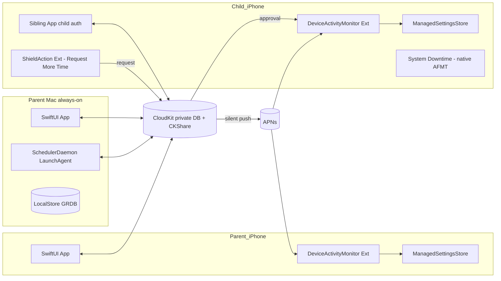

# PLAN_A — Native Swift + CloudKit Screen Time Scheduler

## Context
Per RESEARCH.md, Apple's FamilyControls / ManagedSettings / DeviceActivity frameworks let a third-party app shield apps and run code on schedule, but `ApplicationToken`s are device-scoped, ManagedSettings only writes the local store, and any third-party shield bypasses Apple's native "request more time" UI. This plan embraces those frameworks directly with a multiplatform SwiftUI app and CloudKit for cross-device sync, and addresses the AFMT problem with a hybrid: Apple's system Downtime continues to enforce the dominant block (preserving native AFMT), while additional intra-day windows are enforced by our own ManagedSettings shields with an in-app reimplementation of request/approve.

## Architecture diagram



## Ask-For-More-Time tradeoff (hybrid)
Each `Window` declares `enforcement: .systemDowntimeMirror | .managedSettingsShield`.

- `.systemDowntimeMirror`: the user configured Apple's system Downtime to match this window during onboarding. We do NOT shield; we just track that the OS is enforcing it. Native AFMT works unchanged. Used for the dominant block (e.g. overnight).
- `.managedSettingsShield`: our DeviceActivityMonitorExtension writes a ManagedSettingsStore shield over the chosen apps for the window. AFMT is reimplemented in-app via a `ShieldActionExtension` "Request more time" button → CloudKit → APNs to parent → parent approves → child store clears for N minutes via a one-shot schedule.

The user picks per window which behavior they want, with the expectation that exactly one window per day uses `.systemDowntimeMirror`.

## Data model
- `Schedule`: per-account weekly template, list of `Window`s, version, updatedAt.
- `Window`: `id: UUID`, `weekdays: Weekdays`, `start: TimeOfDay`, `end: TimeOfDay`, `enforcement: Enforcement`, `groupId: WindowGroupID`, `allowRequests: Bool`.
- `Override`: append-only. `id`, `accountId`, `date` (in account tz), `action: skipWindow(id) | extendWindow(id, minutes) | addBlock(start,end) | disableAllForDay`, `createdBy`, `createdAt`, `expiresAt = next local midnight`.
- `Account`: `id`, `role: .self | .child`, `appleIDHash`, `deviceList`, `tokenBundleRef`.
- `TokenBundle`: per-device opaque token blobs (since tokens are device-scoped) keyed by `deviceId`, indexed by stable `WindowGroupID` so the same logical "Social apps" group resolves to different opaque tokens on each device.
- `CDExtensionRequest`: child-originated request for more time on a shielded window.

## Sync strategy (CloudKit)
- Parent's iCloud private DB, custom zone `ScheduleZone`, CKShare invitation accepted by each child during pairing so child's own iCloud account can read/write the shared records.
- Records: `CDSchedule`, `CDWindow`, `CDOverride`, `CDAccount`, `CDDeviceRegistration`, `CDExtensionRequest`. Per-type `CKQuerySubscription`s emit silent pushes.
- Each device runs an `actor SyncCoordinator` that materializes CK records into a local SQLite (GRDB) cache inside the App Group container, then republishes to the enforcement layer.
- Conflict resolution: last-writer-wins on Schedule/Window using `updatedAt`. Overrides are append-only (delete + insert, never edit).
- Tokens are NOT synced as values, only references — each device populates its own `TokenBundle` via `FamilyActivityPicker` once.

## Enforcement on each device
- **iOS (parent or child)**: `DeviceActivityCenter` registers schedules `<windowId>-<weekday>` (seven per window). Inside the `DeviceActivityMonitorExtension`, `intervalDidStart` reads the local cache for current overrides via `OverrideEngine.effectiveWindows(for:)`, decides whether to apply the `ManagedSettingsStore` shield, and writes it. `intervalDidEnd` clears that store. If today's weekday isn't in the bitmap, the extension early-returns.
- **Recovery anchor**: a daily 00:01 schedule re-registers all monitors, recovering from any missed callbacks.
- **macOS (always-on)**: same multiplatform target. Additionally hosts a `SchedulerDaemon` LaunchAgent that (a) writes authoritative schedule changes to CloudKit, (b) prunes expired overrides at local midnight, (c) acts as the always-online APNs receiver to relay extension-request approvals to children whose iOS background delivery is flaky.
- The Mac is the *preferred* authoritative writer; any device can author. If the parent's iPhone is off, the Mac picks up the slack and child devices receive updates via CloudKit push.

## Ask-For-More-Time preserved (hybrid flow)
- Primary nightly Downtime: native, untouched, native AFMT works.
- Secondary windows: child taps shielded app → `ShieldActionExtension` "Request Time" button → writes `CDExtensionRequest` to CloudKit → parent receives a custom `UNNotification` with Approve/Deny actions → on Approve, parent device writes `CDOverride(extendWindow, +15m)` → child's monitor wakes via CK push, clears the shield for the granted duration via a one-shot `DeviceActivitySchedule`. Round-trip target <10s when both devices online.

## Module layout
```
ScreenTimeScheduler/
  App/
    iOSApp.swift, macOSApp.swift, AppDelegate+Push.swift
  Core/
    Models/         Schedule, Window, Override, Account, TokenBundle
    Persistence/    LocalStore (GRDB), AppGroupPaths
    Sync/           CloudKitSchema, SyncCoordinator, SubscriptionManager, ConflictResolver
    Scheduling/     ScheduleCompiler (Schedule -> [DeviceActivitySchedule]), OverrideEngine
    Enforcement/    ShieldController, TokenResolver
    Requests/       ExtensionRequestService, PushRouter
  Extensions/
    DeviceActivityMonitorExtension/   Monitor.swift
    ShieldConfigurationExtension/     ShieldConfig.swift
    ShieldActionExtension/            ShieldAction.swift
  UI/
    Onboarding/   FamilyControlsAuth, SystemDowntimeSetupGuide
    Schedules/    ScheduleEditorView, WindowEditorView, FamilyActivityPickerHost
    Overrides/    TodayOverrideView
    Family/       ChildAccountListView, ChildPairingView
  macOSDaemon/
    SchedulerDaemon.swift (LaunchAgent target)
  Shared/
    Logging.swift, FeatureFlags.swift
```

### Key types
- `struct Window { let id: UUID; var weekdays: Weekdays; var start: TimeOfDay; var end: TimeOfDay; var enforcement: Enforcement; var groupId: WindowGroupID; var allowRequests: Bool }`
- `enum Enforcement { case systemDowntimeMirror; case managedSettingsShield }`
- `actor SyncCoordinator { func start(); func upsert<T: CKSyncable>(_ value: T); func handleRemoteNotification(_ payload: [AnyHashable: Any]) }`
- `struct OverrideEngine { func effectiveWindows(for date: Date, account: Account) -> [ResolvedWindow] }`
- `final class ShieldController { func apply(_ resolved: ResolvedWindow); func clear(_ id: UUID) }`

## Failure modes
1. **CloudKit propagation lag** → child stays shielded longer than intended after Approve. Mitigation: silent push + foreground polling fallback every 60s while a pending request exists; Mac daemon nudges via high-priority `CKModifyRecordsOperation`.
2. **DeviceActivityMonitor missed callback** → shield never applies. Mitigation: redundant 7-day schedules + daily 00:01 anchor that recomputes and re-registers all monitors.
3. **Token drift after iOS upgrade** → tokens may invalidate. Mitigation: `TokenResolver` verifies tokens against installed app inventory at launch; surfaces re-pick UI per group.
4. **Parent's Mac AND iPhone offline** → no authoritative writer for new edits. Mitigation: any device can author; LWW on `updatedAt` resolves later drift.
5. **Child uninstalls app** → blocked by Family Controls `.child` (requires guardian passcode to remove).
6. **iCloud account change** on a device → CK zone resets; re-onboarding required.
7. **macOS API gaps** → some ManagedSettings keys are no-ops on macOS; per-key support matrix disables unsupported windows on Mac targets.
8. **User manually edits system Downtime** → model drifts vs `.systemDowntimeMirror` window. Periodic reconciliation reminder.

## Required Apple entitlements
- `com.apple.developer.family-controls` (app + all 3 extensions, both platforms)
- `com.apple.developer.deviceactivity`
- `com.apple.developer.icloud-services` = CloudKit, plus container identifier
- `aps-environment` = production
- App Group `group.com.example.sts` (shared between app and extensions; both platforms)
- Background modes: remote-notification, processing
- Hardened runtime + LaunchAgent plist for the macOS daemon

## Open risks
1. Apple entitlement review delay (weeks).
2. Reviewer tolerance for reimplementing a request-more-time flow that mimics system UI.
3. macOS DeviceActivity reliability when the Mac sleeps; may need `caffeinate`/`pmset` hints.
4. Token portability UX cost: user must visit `FamilyActivityPicker` on each device once.
5. CKShare flow with child Apple IDs has been tightened by Apple; needs validation.
6. The hybrid model relies on a one-time manual system Downtime setup; drift requires reconciliation.
